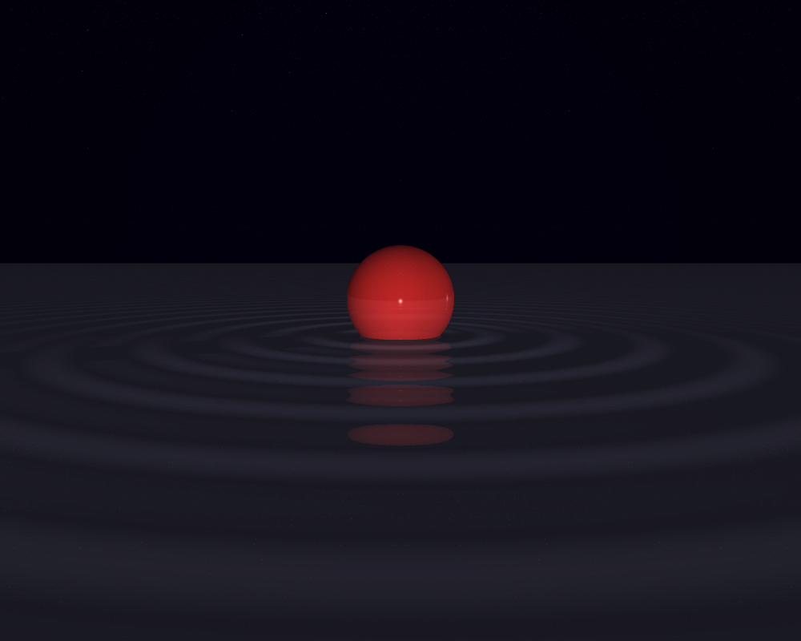

# miniRT


This project is an (insane) introduction to computer graphic proposed by [42](https://www.42.fr/).

A raytracer written in C, from scratch.

It makes use, though, of the [MiniLibX](https://www.google.com) library, that simplifies the interface with the X-Window.

A scene containing one the following primitive shapes can be rendered:
- sphere
- plane
- square
- cylinder
- triangle

Multiple points of view (cameras) and multiple lightspots are handled.

The bonus version of the project has the following additional features:
- multithreaded rendering
- anti-aliasing (adaptive super-sampling)
- reflexions
- normal disruption (wave effect)
- checkerboard texture
- rainbow texture
- parellel light
- Sepia filter
- caps on the cylinders
- extra primitives: cube and pyramid
- camera translation with keyboard
- camera rotation with the mouse

I ~~nearly went crazy~~ enjoyed a lot doing this project. Lots of geometry and linear algebra had to be refreshed. Some serious parsing skills and project organization had to be developed as well.

This program was coded for Linux environment.

## Requiments for Linux:
- gcc
- make
- X11 include files (package xorg)
- XShm extension must be present (package libxext-dev)
- Utility functions from BSD systems - development files (package libbsd-dev)
- e.g. `sudo apt-get install gcc make xorg libxext-dev libbsd-dev` (Debian/Ubuntu)

## Usage:

`make bonus` : this should compile the program with all its cool bonus features

`./miniRT SCENE.rt [--save [FILE]]`: if *--save* option is used, instead of displaying the scene in a window, the view from the first camera will be saved as bmp file (whose name is optionally defined)

The file that describes the scene must have an *.rt* extension. Its format is described in the project's [subject](subject/miniRT_en.pdf).
Tap `./miniRT --help` for the keywords for the bonus functionalities.

An example of a minimalistic scene and its meaning:

```
R	1000	800

A				0.2		255,255,255

l	20,20,20	0.8		255,255,255

c	0,0,30	0,0,-1	60

sp	0,0,0	10			255,255,0
```
- R: resolution is set to 1000 x 800
- A: ambient light intensity is 0.2 (in a 0 to 1 scale), white color (255 for red, green and blue channels)
- l: one lighspot situated at coordinates (x, y, z) 20, 20, 20, with light intensity of 0.8 (0 - 1 scale) and white color
- c: one camera situated at coordinates 0, 0, 30, facing the direction described by the vector 0, 0, -1, with an horizontal field of view of 60 degrees
- sp: a sphere, located at 0, 0, 0, with diameter 10 and color (rgb) 255,255,0

That's the resulting rendered image:


A more interesting scene could be described as below, in which bonus features as anti-aliasing, parallel light source, reflexion and checkerboad texture are showcased:
```
R	1000	800	--anti-aliasing
A	0.15		255,255,255

l	100,100,0	1.0	255,255,255
l	0,0,-1		0.4	255,255,255 --parallel

c	0,130,250	0,-0.4,-0.9		70
c	129,47,202	-0.6,-0.1,-0.8	70
c	0,150,-50	0,-1,0.2		100 --sepia

sp	-50,25,0	50	0,255,0 -s 900 -r 0.5
sp	50,25,0		50	0,000,255 -s 900 -r 0.5
sp	0,25,100	50	255,0,0 -s 900 -r 0.5

pl	0,0,0		0,1,0	255,251,148  -cb 20 -r 0.3 # pl stands for plane
pl	0,0,-100	0,0,1	50,0,0	
```

By the way, the image at the top of this README is this scene viewed from the second camera (c) described above.

Here's a few other rendered scenes for your delight:





